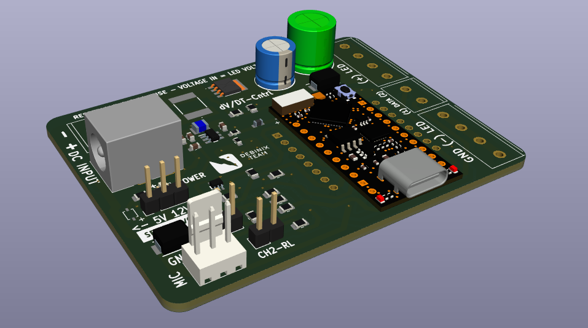

# The WLED Twin Board

## WLED Neopixel projects 

Neopixel pixel projects have found their way into many homes. The `WLED Twin Board` aims to simplify the experience of the standard edition of [WLED](https://kno.wled.ge/) or the [Sound Reactive WLED version](https://github.com/atuline/WLED/) and make a neat, safe installation. 
 
- Works with the WLED App to manage an installation.
- Configure ESP32 channel one: IO4, and channel two: IO27 for digital LED strip data.
- Configure ESP8266 channel one: IO1, and channel two: IO2 for digital LED strip data.
- Configure ESP32: IO33 for analog microphone input (optionally).
- Configure ESP8266: A0 for analog microphone input. The `WLED sound reactive team` does not recommend ESP8266 in this application.

Download the chosen edition of the `WLED firmware` to the microcontroller, set the actual `LED voltage` on board, and you will soon be up and running your project!

## Board main features

This board is suitable for more complex WLED projects spanning multiple rooms. Use numerous boards for higher current capability. The fully assembled board includes:

- Jumper to set LED voltage to either 5V or 12V.
- Self-healing, i.e., resettable fuses (9A).
- Holder to add your Unexpected Maker (UM) TinyPICO ESP32 D4 board.
- Alternative holder for a cheaper Wemos/Lolin ESP8266 board.
- Large output capacitors.
- Start-up inrush circuit. The circuit limits the current load on the DC supply at start-up.
- Includes a 12V to 5V DC/DC converter for powering the microcontroller using LED voltage 12V.
- Dedicated connector for analog microphone input.
- Dual voltage level translated 5V data channels terminals with an optimized signal resistor.
- The data signal resistor value can be reduced from 249 Ohm to 34 Ohm by moving a jumper.
- 4-pole output screw terminals for multiple LED strips.

Unfortunately, the varying current level is often only roughly estimated in WLED projects. An alternative approach is to measure the drawn current with an ESP8266 D1-mini microcontroller and the [WLED DC Sensor Board](https://github.com/berrak/WLED-DC-Sensor-Board/). However, the latter method requires some knowledge of working with code development in [Arduino IDE](https://www.arduino.cc/en/software).

## Suggested items to add to the board

- UM TinyPICO ESP32 microcontroller.
- Wemos/Lolin ESP8266 microcontroller (alternative).
- Male header pins for the microcontroller.
- Analog microphone (option: if using sound reactive WLED firmware).

Purchase UM TinyPico ESP32 at [Pimoroni](https://shop.pimoroni.com/products/tinypico-v2?variant=39285089534035) or [Adafruit](https://www.adafruit.com/?q=TinyPico+ESP32&sort=BestMatch). Do not use the ESP32S2 or ESP32S3 models. The MAX4466-based microphone works well with the board, but other analog microphones may also be suitable for sound-reactive WLED firmware.

Various sellers sell ESP8266 cloned boards on `AliExpress/Amazon`. Buy the original version of ESP8266 at [Lolin](https://lolin.aliexpress.com/store/1331105) official shop.

## Usage

Please, see the documentation for [WLED projects](https://kno.wled.ge/) and how-to install [sound reactive firmware](https://github.com/atuline/WLED/).

## Specification for the WLED Twin board v1.1

The fabricated two-layer board size is 71.7 x 54.4 mm (2.82"x2.14").

| parameter | imperial | metric |
| -----------|-------|------|
| board material | FR4 | FR4 |
| board thickness | 39 mil | 1.0 mm |
| surface finish | HASL | HASL |
| copper layer thickness | 1.4 mil | 35 um |
| board color | black | black |
| board text | white | white |
| board weight | 2.82 oz | 80 gram |

Printed circuit boards use Hot air solder leveling (*HASL*).

## The board is fully assembled and tested

The WLED Twin board is available only fully assembled. The single-channel [WLED React board](https://github.com/berrak/WLED-React-Board) may be an alternative for smaller projects.

## Purchase the board
`Tindie` has all the latest designed boards.

I appreciate your support.